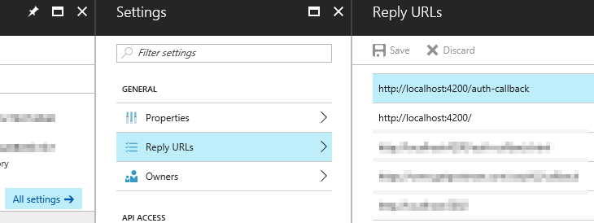
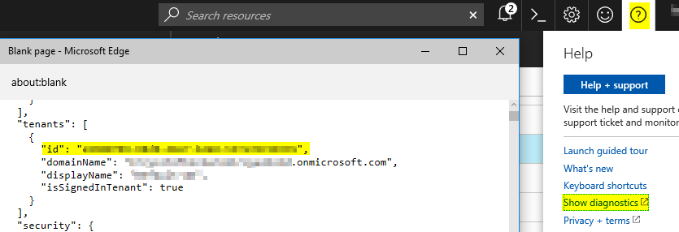
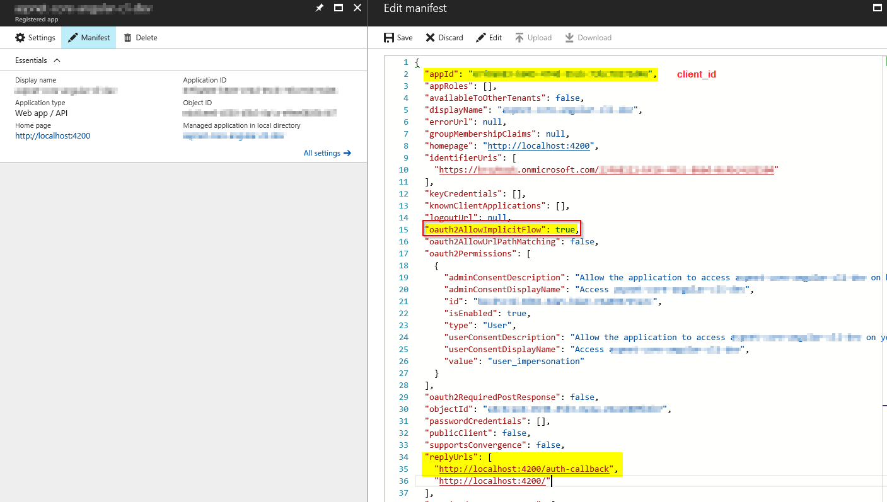

# Frontend: Angular Azure AD example

Copy of [ng2-adal-QuickStart](https://github.com/ranveeraggarwal/ng2-adal-QuickStart) implemented with `angular-cli`. Adal library used: [ng2-adal](https://github.com/sureshchahal/angular2-adal)

[ADAL.JS (adal-angular)](https://blogs.msdn.microsoft.com/premier_developer/2017/04/26/using-adal-with-angular2/) version is implemented on __adaljs__ branch.

__Angular 4.0__ version is implemented on __angular4.0__ branch. Using deprecated `HttpModule`.


This project was generated with [Angular CLI](https://github.com/angular/angular-cli) version 1.5.


# Development

## Frontend

### Setup
Go to `.\src\app\_services\` and replace `adal-config.service.ts.template` with `adal-config.service.ts` and your actual values.

Run
```
npm install
ng serve -o
````

### Routes
* `/home` - main page with Login/Logout buttons
* `/restricted` - a protected with `AuthenticationGuard.canActivate`
* `/unauthorized` - user will be redirected here when tries to access `/restricted` route but is not logged-in. Use _Login_ button first on `/home` page.
* `/auth-callback` - here Azure AD will redirect after successful login/logout process. It must be configured in Azure portal in _Reply URLs_ section and in `secret.service.ts` as `redirectUri` and `postLogoutRedirectUri`.


## Backend - Backend.DotNetCore

### Setup

Set [environment variable](https://docs.microsoft.com/en-us/aspnet/core/fundamentals/environments) on your local machine `ASPNETCORE_ENVIRONMENT=Development`

Update `appsettings.json` and set 
```
"MicrosoftIdentity": {
    "Authority": "https://login.microsoftonline.com/{tenantId}",
    "ClientId": "YOUR CLIENT ID"
}
```
or alternatively set it in `user-secrets` [(Secret Manager) for the project](https://docs.microsoft.com/en-us/aspnet/core/security/app-secrets#secret-manage) 

Run
```
dotnet restore
.\run-server.cmd
````

The `run-server.cmd` is used to run the app on __:44008__ port.

# Azure portal setup
[Azure Portal](https://portal.azure.com)

`Left Menu -> Azure Active Directory -> App registrations -> Select your AD app`

## Setup __Reply URLs__
`Your AD app -> All settings -> Reply URLs`

Set `http://localhost:4200/auth-callback`



## How to get __tenant__


## How to get __client_id__
`Your AD app -> All settings -> Application ID`

## Enable Implicit Flow
`Your AD app -> Manifest`

Set `oauth2AllowImplicitFlow` to `true`
## Manifest
